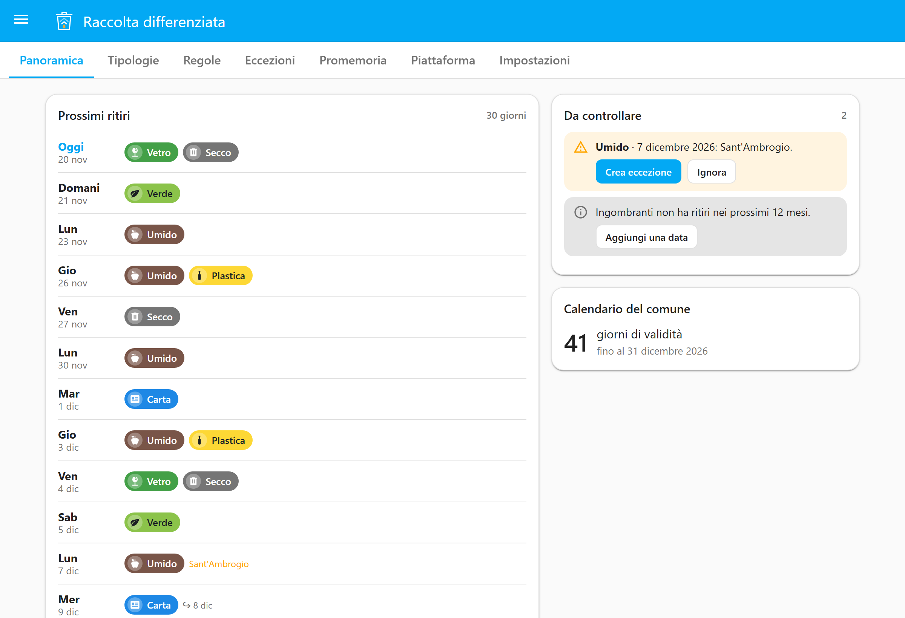
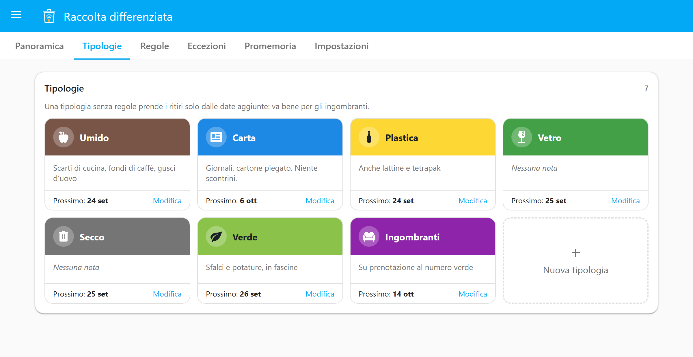
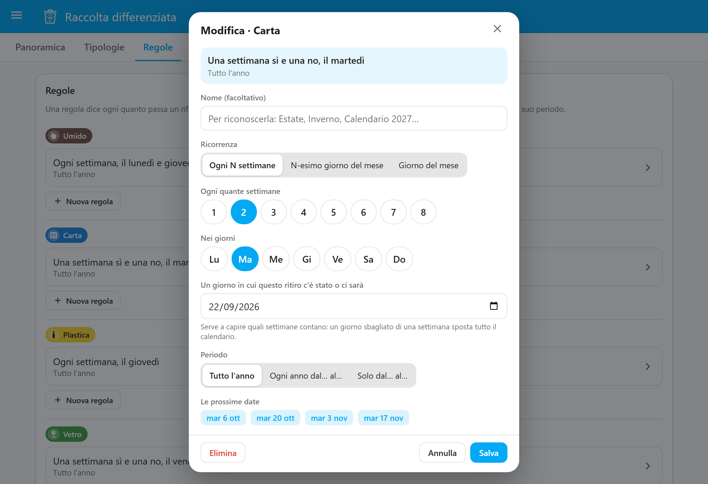
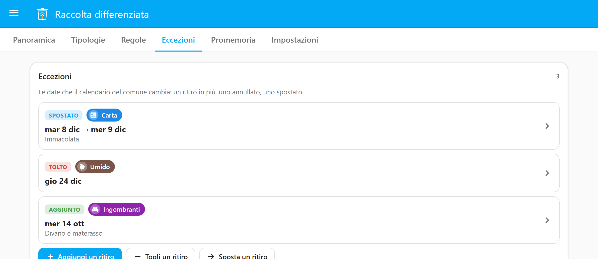
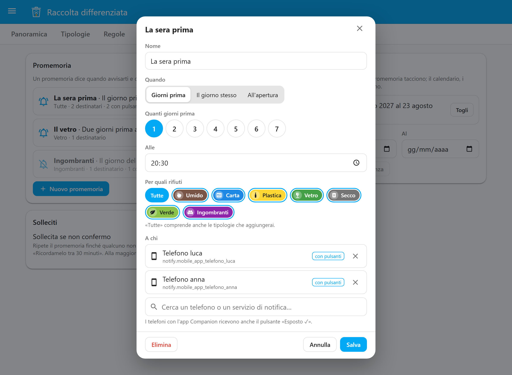
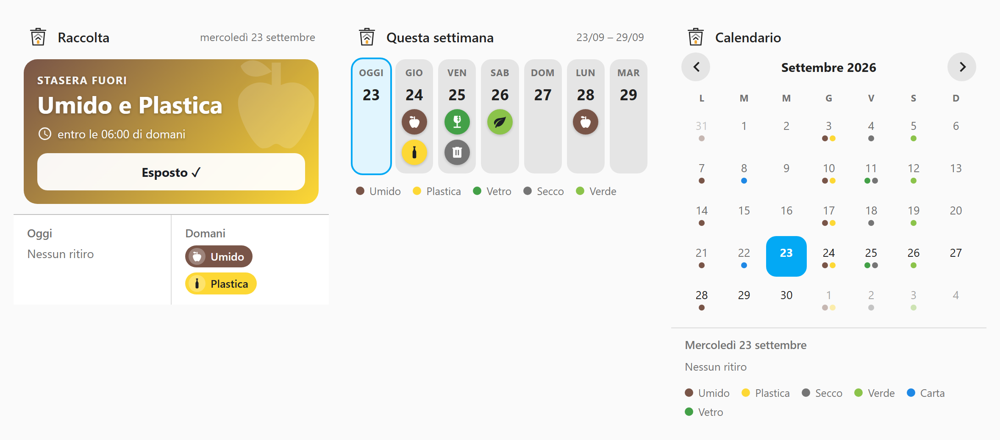
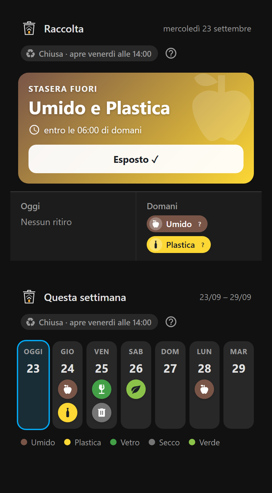
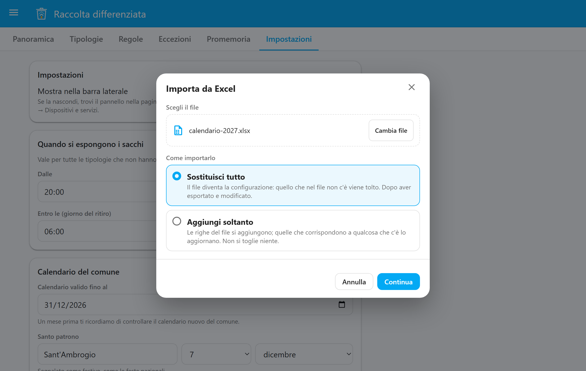

# Guida a Foyer Raccolta Differenziata

Questa guida spiega come si installa, come si inserisce il calendario del tuo comune e come
si usano promemoria, card ed entità. Si legge in dieci minuti; per il perché delle scelte
c'è la [specifica](https://github.com/foyer-labs/Foyer-Raccolta-Differenziata/blob/sviluppo/docs/SPEC.md), sul ramo di sviluppo.

- [Installazione](#installazione)
- [Il pannello](#il-pannello)
- [Tipologie](#tipologie)
- [Regole: quando passano](#regole-quando-passano)
- [Eccezioni: le date che cambiano](#eccezioni-le-date-che-cambiano)
- [Festività](#festività)
- [Promemoria](#promemoria)
- [Esposto ✓](#esposto-)
- [Le card](#le-card)
- [Entità e automazioni](#entità-e-automazioni)
- [Il calendario in Excel](#il-calendario-in-excel)
- [Quando cambia il calendario del comune](#quando-cambia-il-calendario-del-comune)
- [Domande frequenti](#domande-frequenti)

## Installazione

Ti servono Home Assistant 2026.6 o successivo e, per i promemoria, un servizio di notifica
che funziona (l'app Companion va benissimo).

1. In HACS apri *Integrazioni*, menu ⋮ → *Repository personalizzati*, aggiungi
   `https://github.com/foyer-labs/Foyer-Raccolta-Differenziata` con categoria
   *Integrazione*. Installa **Foyer Raccolta Differenziata** e riavvia Home Assistant.
2. *Impostazioni → Dispositivi e servizi → Aggiungi integrazione →
   Foyer Raccolta Differenziata*.
3. Scegli le tipologie da cui partire (umido, carta, plastica, vetro, secco, verde e, se
   ti servono, pannolini: le potrai cambiare) e quando si espongono i sacchi. Di solito è *dalle 20:00 del giorno
   prima alle 06:00 del giorno del ritiro*: controlla cosa dice il tuo comune.

Senza HACS: copia la cartella `custom_components/foyer_raccolta_differenziata` di una
[release](https://github.com/foyer-labs/Foyer-Raccolta-Differenziata/releases) nella
cartella `custom_components` di Home Assistant e riavvia.

## Il pannello

Dopo l'installazione compare **Raccolta** nella barra laterale (solo per gli
amministratori). La *Panoramica* mostra i ritiri dei prossimi 30 giorni e le cose da
controllare.

<p align="center"></p>

**Ogni salvataggio passa da *Prima di salvare*:** vedi quali ritiri si aggiungono o
spariscono nei prossimi 60 giorni prima di confermare. Una regola sbagliata non dà errori,
dà un calendario plausibile e sbagliato: questo è il momento di accorgersene.

Non vuoi il pannello nella barra laterale? In *Impostazioni* del pannello, oppure in
*Dispositivi e servizi → Raccolta differenziata → Configura*, spegni *Mostra nella barra
laterale*. Lo ritrovi nella pagina del dispositivo *Raccolta differenziata*, dal
collegamento alla configurazione.

## Tipologie

Una tipologia è un tipo di rifiuto: nome, colore, icona e una nota su cosa ci va, che le
card mostrano. Per l'icona scrivi cosa cerchi (*umido*, *pannolini*, *divano*…) e scegli
dall'elenco, oppure scrivi direttamente un'icona di Material Design come `mdi:recycle`.

<p align="center"></p>

Se un rifiuto va esposto in orari diversi dagli altri (il vetro la mattina stessa, per
esempio), spunta *Orario di esposizione diverso da quello generale*.

Una tipologia senza regole prende i ritiri solo dalle date che aggiungi: è il modo di
gestire gli ingombranti su prenotazione.

## Regole: quando passano

Una regola dice ogni quanto passa un rifiuto. Si scrive come la scrive il comune:

| Il comune dice | Nel pannello |
|---|---|
| "Umido lunedì e giovedì" | *Ogni N settimane*, ogni settimana, Lu e Gi |
| "Carta a martedì alterni" | *Ogni N settimane*, 2 settimane, Ma |
| "Vetro il secondo mercoledì del mese" | *N-esimo giorno del mese*, 2°, Me |
| "Ingombranti il 15 di ogni mese" | *Giorno del mese*, 15 |

Mentre compili, sotto compaiono **le prossime date**: se non tornano con il calendario del
comune, la regola è sbagliata.

<p align="center"></p>

### Il giorno di riferimento

Per "una settimana sì e una no" il sistema deve sapere *quali* settimane. Per questo chiede
**un giorno in cui il ritiro c'è stato o ci sarà**: prendi una data dal calendario del
comune. Esempio: la carta passa il martedì a settimane alterne, e il comune indica il
22 settembre; scrivi 22/09. Il sistema conta da lì, anche all'indietro. Se sbagli di una
settimana, tutte le date slittano di una settimana: guarda le prossime date prima di
salvare.

### Estate e inverno

Ogni regola ha un periodo: *Tutto l'anno*, *Ogni anno dal… al…* (per esempio dal 1° aprile
al 31 ottobre, anche a cavallo d'anno) oppure *Solo dal… al…* con l'anno, per un calendario
che vale solo per quel periodo. Il verde ogni settimana d'estate e ogni due d'inverno sono
due regole, una per periodo.

Più regole della stessa tipologia si sommano. Una regola con l'anno, invece, **sostituisce**
le altre della stessa tipologia nel suo periodo: è il modo di inserire il calendario nuovo
senza cancellare quello vecchio. In entrambi i casi la Panoramica te lo segnala.

Nei mesi che non hanno il giorno indicato (il 31 ad aprile) il ritiro non avviene: se il tuo
comune lo sposta, aggiungi un'eccezione.

## Eccezioni: le date che cambiano

Il calendario del comune cambia sempre intorno alle feste. Nella pagina *Eccezioni*:

- **Aggiungi** un ritiro in più (un passaggio straordinario, una data degli ingombranti);
- **Togli** un ritiro annullato;
- **Sposta** un ritiro da un giorno a un altro: le card lo mostrano come spostato.

<p align="center"></p>

## Festività

Il sistema conosce le festività nazionali (Pasqua compresa, e San Francesco il 4 ottobre dal
2026) e il santo patrono che indichi in *Impostazioni*. Quando un ritiro cade in un giorno
festivo **non lo sposta**: te lo segnala in Panoramica e in *Riparazioni* di Home Assistant
nei 30 giorni prima. Controlla cosa ha deciso il comune, poi *Crea eccezione* o *Ignora*.

## Promemoria

Nella pagina *Promemoria* crei uno o più avvisi: quando (N giorni prima a un'ora, il giorno
stesso, oppure quando si possono mettere fuori i sacchi), per quali rifiuti e a chi.

<p align="center"></p>

Nel campo *A chi* scrivi per cercare (un nome o un pezzo di `notify.…`), scegli dai
suggerimenti, e togli un destinatario con la ✕ accanto. I filtri sopra i suggerimenti
separano i telefoni con l'app Companion dagli altri servizi e dalle entità di notifica.

Più rifiuti nello stesso giorno arrivano in un messaggio solo: *Stasera fuori: Umido e
Plastica*. I telefoni con l'app Companion ricevono anche il pulsante **Esposto ✓**; gli
altri servizi (Telegram, email, …) ricevono il testo.

**Solleciti.** Spenti di default. Accesi, il promemoria si ripete (una o due volte, a
intervalli che scegli) finché qualcuno non conferma, e la notifica ha anche *Ricordamelo
tra 30 minuti*. Non si sollecita un avviso anticipato: il sollecito parte solo quando si
possono già esporre i sacchi.

**Vacanze.** Nelle date indicate i promemoria tacciono; conta il giorno in cui partirebbe
la notifica. L'interruttore *Sospendi promemoria* fa lo stesso da subito, finché non lo
spegni.

Se Home Assistant era spento all'ora di un promemoria, al riavvio il promemoria parte, purché
sia ancora il momento di esporre i sacchi.

## Esposto ✓

Hai messo fuori il sacco? Dillo in uno di questi modi, e gli altri promemoria di quel ritiro
non partono più, per nessuno in casa:

- il pulsante **Esposto ✓** nella notifica;
- la card *Oggi e domani*;
- l'entità `button.raccolta_differenziata_esposto`: comoda con un tag NFC o un pulsante
  accanto alla porta. Conferma i sacchi da esporre adesso; se è presto, quelli di oggi o
  di domani.

## Le card

Tre card, già disponibili nel selettore delle card delle dashboard (*Aggiungi card* →
cerca *Raccolta*): non serve aggiungere risorse.

<p align="center"></p>

<p align="center"></p>

In YAML:

```yaml
type: custom:foyer-raccolta-oggi-card
```

```yaml
type: custom:foyer-raccolta-settimana-card
inizio: lunedi   # oppure oggi (predefinito)
```

```yaml
type: custom:foyer-raccolta-mese-card
titolo: Calendario rifiuti   # facoltativo, per tutte e tre
```

## Entità e automazioni

| Entità | Cosa dice |
|---|---|
| `calendar.raccolta_differenziata` | Un evento per ogni ritiro, anche nel calendario di Home Assistant |
| `sensor.raccolta_differenziata_oggi` | I rifiuti di oggi ("Umido, Carta" oppure "Nessuno") |
| `sensor.raccolta_differenziata_domani` | I rifiuti di domani |
| `sensor.raccolta_differenziata_prossimo_ritiro_<tipologia>` | La data del prossimo ritiro, con `giorni_mancanti` |
| `binary_sensor.raccolta_differenziata_da_esporre` | Acceso quando c'è un sacco da mettere fuori e nessuno ha confermato |
| `button.raccolta_differenziata_esposto` | Conferma |
| `switch.raccolta_differenziata_sospendi_promemoria` | Sospende i promemoria |

Una luce accanto alla porta che resta accesa finché i sacchi non sono fuori:

```yaml
automation:
  - alias: Luce della raccolta
    triggers:
      - trigger: state
        entity_id: binary_sensor.raccolta_differenziata_da_esporre
    actions:
      - action: >-
          {{ 'light.turn_on' if trigger.to_state.state == 'on' else 'light.turn_off' }}
        target:
          entity_id: light.ingresso
```

Se la configurazione non è valida o il calendario non si può calcolare, le entità diventano
*non disponibili*: non dicono mai "Nessuno" quando il sistema non lo sa.

## Il calendario in Excel

Se preferisci un foglio di calcolo, in *Impostazioni* trovi **Configurazione in Excel**:

- **Scarica il modello**: un file con una guida alla compilazione (foglio *Leggimi*) e un
  foglio per ogni cosa: *Tipologie*, *Regole*, *Eccezioni*, *Promemoria*, *Vacanze*,
  *Impostazioni*. Le sei tipologie di base sono già scritte; in ogni foglio una riga
  grigia fa da esempio, e passando sulle intestazioni leggi cosa va in ogni colonna.
- **Esporta in Excel**: lo stesso file, con la tua configurazione dentro. È il modo più
  rapido per cambiare tante cose insieme, o per passare il calendario a un vicino.
- **Importa da Excel…**: scegli il file e come importarlo.
  - **Sostituisci tutto**: il file diventa la configurazione, e quello che nel file non
    c'è viene tolto. Usalo dopo aver esportato e modificato.
  - **Aggiungi soltanto**: le righe del file si aggiungono, e quelle che corrispondono a
    qualcosa che c'è già lo aggiornano. Non si toglie niente: comodo per incollare le
    date del calendario nuovo nel foglio *Eccezioni*.

Si scrive come parli: giorni *Lun, Gio*, *2°, ultimo* per i mensili, date *22/09/2026*,
periodi *Ogni anno* dal *01/06* al *30/09*, orari *20:00*. Se qualcosa non va, il pannello
dice il foglio, la riga e la colonna, e non salva niente. Se va tutto bene, vedi prima
cosa cambia, come per ogni altra modifica.

<p align="center"></p>

Va bene qualunque programma che salvi in `.xlsx`: Excel, LibreOffice, Google Fogli.
Non modificare la colonna nascosta *ID*: collega ogni riga a quello che c'è in Home
Assistant.

## Quando cambia il calendario del comune

In *Impostazioni* indica **fino a quando vale il calendario**. Un mese prima compare un
avviso in *Riparazioni*: controlla il calendario nuovo, aggiorna regole ed eccezioni (anche
[dal file Excel](#il-calendario-in-excel)), poi dall'avviso indica la nuova data. Dopo la
scadenza i ritiri continuano, segnati come *da verificare*.

## Domande frequenti

**Il sistema scarica il calendario del mio comune?** No. Ricorda quello che gli insegni, e
ti avvisa quando è il momento di ricontrollarlo.

**Ho sbagliato una regola e le date sono sfalsate di una settimana.** Correggi il giorno di
riferimento della regola: le prossime date nell'editor ti dicono subito se ora è giusto.

**Posso avere due case?** No: un calendario per installazione.

**I promemoria non arrivano.** Controlla che il profilo sia attivo, che il destinatario
esista ancora in Home Assistant, che l'interruttore *Sospendi promemoria* sia spento e che
oggi non sia in vacanza. Gli errori di consegna finiscono nel registro di Home Assistant.

**Dove chiedo aiuto?** Vedi [SUPPORT.md](../SUPPORT.md).
