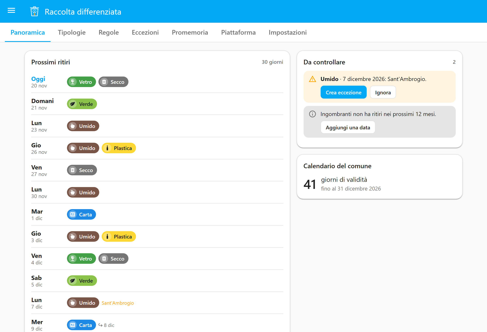
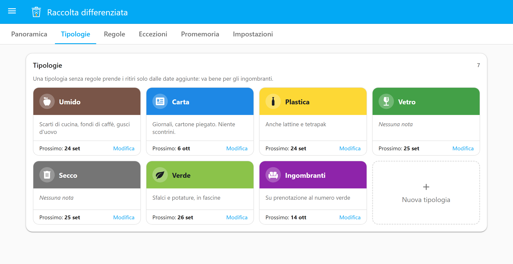
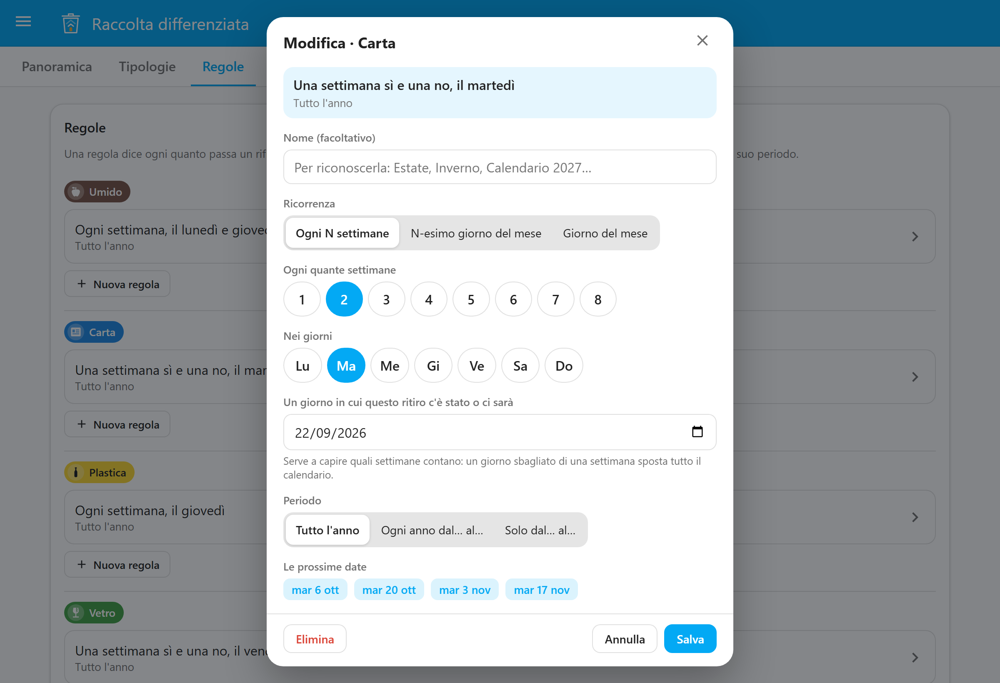
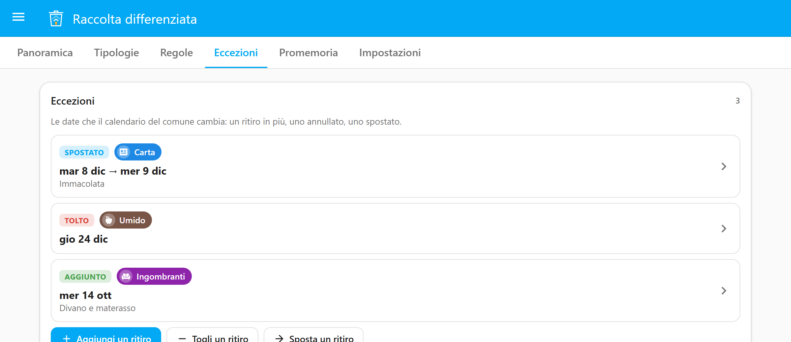
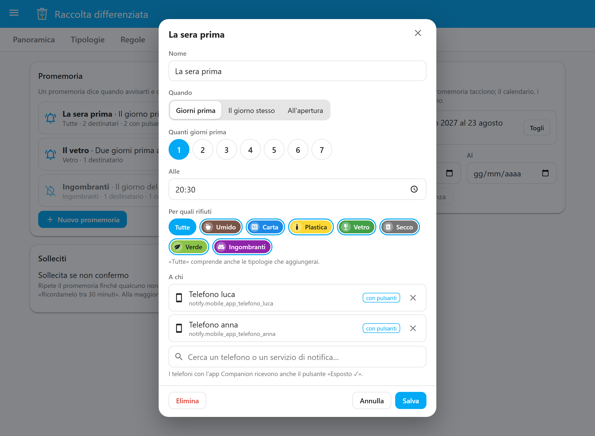
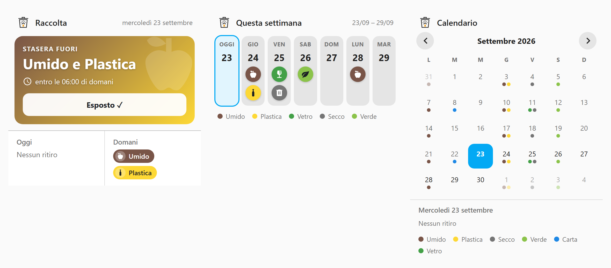
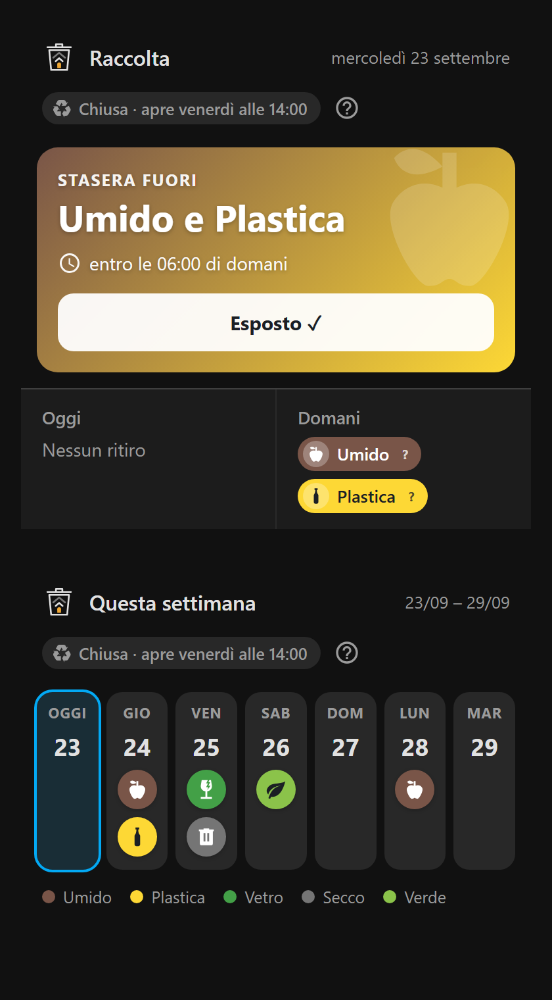
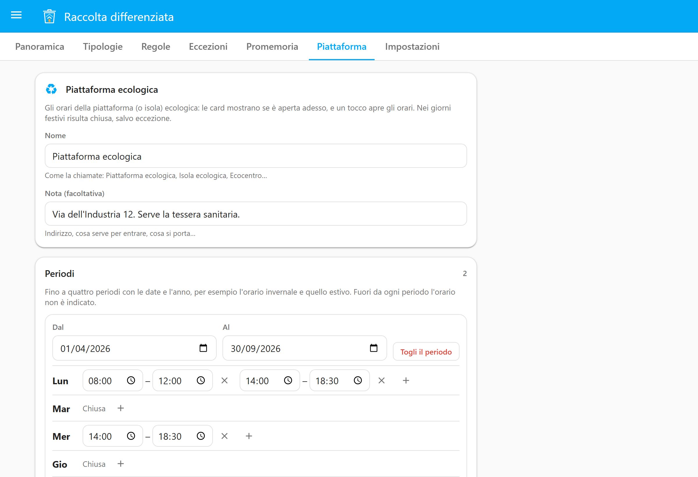
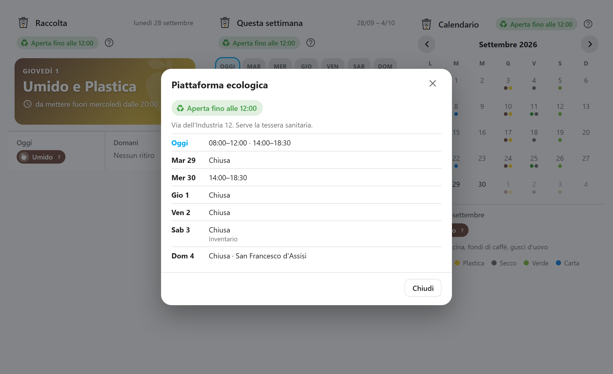
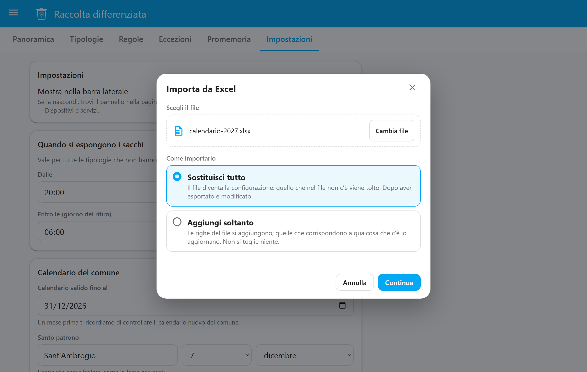

# Foyer Raccolta Differenziata guide

English · [Italiano](https://github.com/foyer-labs/Foyer-Raccolta-Differenziata/blob/main/docs/GUIDA.md)

> This is the English translation of the
> [Italian guide](https://github.com/foyer-labs/Foyer-Raccolta-Differenziata/blob/main/docs/GUIDA.md).
> The integration's interface is in Italian only, on purpose: it models how waste
> collection and its reminders work in Italian towns. Throughout this guide, labels are
> shown in Italian exactly as you will see them, with an English translation.

*Raccolta differenziata* is Italian for separate waste collection: each type of waste is
collected on its own days. A few Italian terms come up often in this guide:

- **umido**: organic/food waste; **secco**: residual, unsorted waste;
  **multimateriale**: mixed recyclables collected together (for example plastic and cans);
- **piattaforma ecologica** or **isola ecologica**: the municipal recycling centre;
- **comune**: your municipality, the town council that sets the collection calendar;
- **patrono**: the patron saint's day, a local holiday that differs from town to town;
- **ingombranti**: bulky waste (furniture, mattresses…); **RAEE**: WEEE, electronic waste.

This guide explains how to install the integration, how to enter your town's calendar, and
how to use reminders, cards and entities. It takes ten minutes to read; for the reasons
behind the design choices there is the
[specification](https://github.com/foyer-labs/Foyer-Raccolta-Differenziata/blob/sviluppo/docs/SPEC.md)
(in Italian), on the development branch.

- [Installation](#installation)
- [The panel](#the-panel)
- [Waste types](#waste-types)
- [Rules: when collection happens](#rules-when-collection-happens)
- [Exceptions: dates that change](#exceptions-dates-that-change)
- [Holidays](#holidays)
- [Reminders](#reminders)
- [Esposto ✓ (put out)](#esposto--put-out)
- [The cards](#the-cards)
- [The recycling centre](#the-recycling-centre)
- [Entities and automations](#entities-and-automations)
- [The calendar in Excel](#the-calendar-in-excel)
- [When your town's calendar changes](#when-your-towns-calendar-changes)
- [Frequently asked questions](#frequently-asked-questions)

## Installation

You need Home Assistant 2026.6 or later and, for reminders, a notification service that
works (the Companion app is perfect).

1. Open the repository in HACS with this button:

   <a href="https://my.home-assistant.io/redirect/hacs_repository/?owner=foyer-labs&repository=Foyer-Raccolta-Differenziata&category=integration"></a>

   Or by hand: in HACS, ⋮ menu at the top right → *Custom repositories*, add
   `https://github.com/foyer-labs/Foyer-Raccolta-Differenziata` with type *Integration*.
   Download **Foyer Raccolta Differenziata** and restart Home Assistant.
2. Add the integration with this button:

   <a href="https://my.home-assistant.io/redirect/config_flow_start/?domain=foyer_raccolta_differenziata"></a>

   Or by hand: *Settings → Devices & services → Add integration →
   Foyer Raccolta Differenziata*. The setup screen is in Italian even if your Home
   Assistant is in English.
3. Choose the waste types to start from (umido, carta, plastica, vetro, secco, verde and, if
   you need it, pannolini: you can change them later) and when the bags go out. Usually it
   is *dalle 20:00 del giorno prima alle 06:00 del giorno del ritiro* ("from 20:00 the day
   before until 06:00 on collection day"): check what your town says.

Without HACS: copy the `custom_components/foyer_raccolta_differenziata` folder from a
[release](https://github.com/foyer-labs/Foyer-Raccolta-Differenziata/releases) into Home
Assistant's `custom_components` folder and restart.

## The panel

After installation, **Raccolta** ("collection") appears in the sidebar (for administrators
only). The *Panoramica* ("overview") tab shows the collections in the next 30 days and the
things to check.

<p align="center"></p>

**Every save goes through *Prima di salvare* ("before saving"):** you see which
collections are added or disappear in the next 60 days before you confirm. A wrong rule
gives no error, it gives a calendar that looks plausible and is wrong: this is the moment
to notice. If something is off, **Indietro** ("back") takes you back to editing; to drop
the change, press *Annulla* ("cancel") there.

Don't want the panel in the sidebar? In the panel's *Impostazioni* ("settings") tab, or in
*Devices & services → Raccolta differenziata → Configure*, turn off *Mostra nella barra
laterale* ("show in sidebar"). You can still reach it from the *Raccolta differenziata*
device page, through the configuration link.

## Waste types

A waste type (*Tipologia*) is a kind of waste: name, colour, icon, the emoji used in
notifications and a note on what goes in it, which the cards show. You can leave the emoji
empty: the notification uses the one that matches the icon (🍎 for the apple, 📰 for the
newspaper…). For the icon, type what you are looking for in Italian (*umido*,
*pannolini*, *divano* — "sofa"…) and pick from the list, or type a Material Design icon
directly, such as `mdi:recycle`.

The preset types are **Umido** (organic), **Carta** (paper), **Plastica** (plastic),
**Vetro** (glass), **Secco** (residual waste), **Verde** (garden waste) and
**Pannolini** (nappies/diapers).

<p align="center"></p>

If one type of waste goes out at different times from the others (glass on the morning
itself, for example), tick *Orario di esposizione diverso da quello generale* ("put-out
time different from the general one").

A waste type with no rules only gets collections from the dates you add: this is how to
handle bulky waste (ingombranti) collected by appointment.

## Rules: when collection happens

A rule says how often a type of waste is collected. You write it the way your town writes
it:

| Your town says | In the panel |
|---|---|
| "Umido Monday and Thursday" | *Ogni N settimane* ("every N weeks"), every week, Lu and Gi (Mon, Thu) |
| "Carta on alternate Tuesdays" | *Ogni N settimane*, 2 weeks, Ma (Tue) |
| "Vetro on the second Wednesday of the month" | *N-esimo giorno del mese* ("Nth weekday of the month"), 2°, Me (Wed) |
| "Ingombranti on the 15th of every month" | *Giorno del mese* ("day of the month"), 15 |

As you fill in the form, **the next dates** appear below it: if they don't match your
town's calendar, the rule is wrong.

<p align="center"></p>

### The reference day

For "every other week" the system needs to know *which* weeks. That is why it asks for
**a day on which the collection took place or will take place**: take a date from your
town's calendar. Example: paper is collected on Tuesdays in alternate weeks, and the town
lists 22 September; enter 22/09. The system counts from there, backwards too. If you are
off by one week, every date shifts by a week: check the next dates before saving.

### Summer and winter

Every rule has a period: *Tutto l'anno* ("all year"), *Ogni anno dal… al…* ("every year
from… to…", for example from 1 April to 31 October, also across the new year) or *Solo
dal… al…* ("only from… to…") with the year, for a calendar that only applies to that
period. Garden waste every week in summer and every two weeks in winter is two rules, one
per period.

Several rules for the same waste type add up. A rule with a year, instead, **replaces**
the others for the same waste type during its period: this is how you enter the new
calendar without deleting the old one. In both cases the Panoramica points it out to you.

In months that don't have the given day (the 31st in April) there is no collection: if
your town moves it, add an exception.

## Exceptions: dates that change

Your town's calendar always changes around the holidays. On the *Eccezioni*
("exceptions") tab:

- **Aggiungi** ("add") an extra collection (a special round, a bulky-waste date);
- **Togli** ("remove") a cancelled collection;
- **Sposta** ("move") a collection from one day to another: the cards show it as moved.

<p align="center"></p>

## Holidays

The system knows the Italian national holidays (Easter included, and St Francis on
4 October from 2026) and the patron saint's day you set in *Impostazioni*. When a
collection falls on a holiday **it does not move it**: it flags it in the Panoramica and in
Home Assistant's *Repairs* during the 30 days before. Check what your town has decided,
then *Crea eccezione* ("create exception") or *Ignora* ("ignore").

## Reminders

On the *Promemoria* ("reminders") tab you create one or more alerts: when (N days before at
a set time, on the day itself, or when the bags can go out), for which waste and to whom.

<p align="center"></p>

In the *A chi* ("to whom") field, type to search (a name or part of `notify.…`), pick from
the suggestions, and remove a recipient with the ✕ next to it. The filters above the
suggestions separate phones with the Companion app from other services and from notify
entities.

Several types of waste on the same day arrive in a single message:

> **🍎 Umido · 🧴 Plastica**\
> Da mettere fuori stasera, entro domani alle 06:00\
> Ritiro domani, giovedì 24

("Organic · Plastic — To put out tonight, by 06:00 tomorrow — Collection tomorrow,
Thursday 24th.")

Phones with the Companion app also get the **Esposto ✓** ("put out") button, and on
Android the notification has the waste type's icon and colour; other services (Telegram,
email, …) get a title and text. On Android the notifications have their own channel,
*Raccolta differenziata*: in the app's settings you choose its sound and importance.

**Test.** *Invia una prova* ("send a test"), below *A chi*, immediately sends the
notification for the next collection to the chosen recipients, even before you save: you
see what it looks like and whether it arrives. Its buttons confirm nothing.

**Nagging.** Off by default. When on, the reminder repeats (once or twice, at intervals you
choose) until someone confirms, and the notification also has *Ricordamelo tra 30 minuti*
("remind me in 30 minutes"). An early alert is never repeated: nagging only starts once the
bags can already go out.

**Vacanze (time away).** On the dates you set, reminders stay silent; what counts is the day the
notification would be sent. The *Sospendi promemoria* ("pause reminders") switch does the
same straight away, until you turn it off.

If Home Assistant was off at a reminder's time, the reminder is sent on restart, as long as
it is still time to put the bags out.

## Esposto ✓ (put out)

Put the bag out? Say so in one of these ways, and the other reminders for that collection
are no longer sent, to anyone in the house:

- the **Esposto ✓** button in the notification;
- the *Oggi e domani* ("today and tomorrow") card;
- the `button.raccolta_differenziata_esposto` entity: handy with an NFC tag or a button
  by the door. It confirms the bags to put out right now; if it is early, those for today
  or tomorrow.

## The cards

Three cards, already available in the card picker: no need to add resources or write YAML.
Open the dashboard, *Edit dashboard* (the pencil), **Add card → By card** and search for
**Raccolta**: you will find *Raccolta: oggi e domani* ("today and tomorrow"), *Raccolta:
settimana* ("week") and *Raccolta: mese* ("month"), with a preview. Pick one and adjust
title and options in the visual editor.

Among the dashboard resources (*Settings → Dashboards → ⋮ → Resources*) you will find an
entry added by the integration, `/api/foyer_raccolta_differenziata/frontend/loader.js`:
it is what brings the cards to the app too. Leave it there; if you remove it, it comes
back at the next restart, and it goes away by itself when you remove the integration.
With YAML resources the entry never ends up in your files.

<p align="center"></p>

<p align="center"></p>

In each card's header:

- the **?** opens *Cosa va dove* ("what goes where"): every waste type with its note (you
  write the notes in *Tipologie*, "waste types"). A chip with a small **?** can also be
  tapped to read its note;
- if you have entered the opening hours of the
  [recycling centre](#the-recycling-centre), an indication such as *Aperta fino alle
  12:00* ("open until 12:00") or *Chiusa · apre giovedì alle 14:00* ("closed · opens
  Thursday at 14:00"); tap it to see the week's opening hours. You can hide it in the card
  editor.

If you prefer YAML:

```yaml
type: custom:foyer-raccolta-oggi-card
```

```yaml
type: custom:foyer-raccolta-settimana-card
inizio: lunedi   # or oggi (today, the default)
```

```yaml
type: custom:foyer-raccolta-mese-card
titolo: Calendario rifiuti   # optional, for all three
```

## The recycling centre

On the panel's **Piattaforma** ("recycling centre") tab you enter the opening hours of the
piattaforma (or isola) ecologica: *Inserisci gli orari* ("enter the opening hours"), then

- a **name** (Piattaforma ecologica, Isola ecologica, Ecocentro…) and an optional
  **note**, for example the address;
- one to four **periods** with dates and year, for example the winter and summer hours;
  on each day one to three **time slots**, or none if it is closed. *Aggiungi un periodo*
  ("add a period") copies the last period's hours and starts the day after: correct and
  save;
- **days with different hours**: an unscheduled closure, or opening on a holiday.

On holidays (national and the patron saint's day) it shows as closed, unless there is a day
with different hours. Outside the periods the hours are *non indicato* ("not given"): the
cards don't say "closed" if they don't know. A month before the hours you entered run out,
the Panoramica reminds you.

<p align="center"></p>

The cards show whether it is open right now, and a tap opens the hours:

<p align="center"></p>

## Entities and automations

| Entity | What it tells you |
|---|---|
| `calendar.raccolta_differenziata` | One event per collection, also in Home Assistant's calendar |
| `sensor.raccolta_differenziata_oggi` | Today's waste ("Umido, Carta" or "Nessuno", none) |
| `sensor.raccolta_differenziata_domani` | Tomorrow's waste |
| `sensor.raccolta_differenziata_prossimo_ritiro_<tipologia>` | The date of the next collection of that waste type, with `giorni_mancanti` (days left) |
| `binary_sensor.raccolta_differenziata_da_esporre` | On when there is a bag to put out and nobody has confirmed |
| `button.raccolta_differenziata_esposto` | Confirms |
| `switch.raccolta_differenziata_sospendi_promemoria` | Pauses reminders |
| `binary_sensor.raccolta_differenziata_piattaforma_ecologica` | On when the recycling centre is open, with `chiude_alle` (closes at) and `apre_alle` (opens at); only exists if you have entered the opening hours |

A light by the door that stays on until the bags are out:

```yaml
automation:
  - alias: Collection light
    triggers:
      - trigger: state
        entity_id: binary_sensor.raccolta_differenziata_da_esporre
    actions:
      - action: >-
          {{ 'light.turn_on' if trigger.to_state.state == 'on' else 'light.turn_off' }}
        target:
          entity_id: light.ingresso
```

If the configuration is not valid or the calendar cannot be calculated, the entities become
*unavailable*: they never say "Nessuno" (none) when the system does not know.

## The calendar in Excel

If you prefer a spreadsheet, in *Impostazioni* you will find **Configurazione in Excel**
("configuration in Excel"):

- **Scarica il modello** ("download the template"): a file with a guide to filling it in
  (the *Leggimi*, "read me", sheet) and one sheet for each thing: *Tipologie* (waste
  types), *Regole* (rules), *Eccezioni* (exceptions), *Promemoria* (reminders), *Vacanze*
  (time away), *Piattaforma* (recycling centre), *Piattaforma eccezioni* (recycling centre
  exceptions), *Impostazioni* (settings). The six basic waste types (all but pannolini) are already filled in;
  in every sheet a grey row serves as an example, and hovering over the headers tells you
  what goes in each column.
- **Esporta in Excel** ("export to Excel"): the same file, with your configuration in it.
  It is the quickest way to change many things at once, or to pass the calendar on to a
  neighbour.
- **Importa da Excel…** ("import from Excel"): choose the file and how to import it.
  - **Sostituisci tutto** ("replace everything"): the file becomes the configuration, and
    whatever is not in the file is removed. Use it after exporting and editing.
  - **Aggiungi soltanto** ("add only"): the file's rows are added, and those that match
    something already there update it. Nothing is removed: handy for pasting the new
    calendar's dates into the *Eccezioni* sheet.

You write it the way you would say it, in Italian: days *Lun, Gio* (Mon, Thu), *2°,
ultimo* (2nd, last) for monthly rules, dates *22/09/2026*, periods *Ogni anno* (every
year) from *01/06* to *30/09*, times *20:00*. If something is wrong, the panel tells you
the sheet, row and column, and saves nothing. If everything is fine, you first see what
changes, as with any other edit.

<p align="center"></p>

Any program that saves `.xlsx` will do: Excel, LibreOffice, Google Sheets. Do not edit the
hidden *ID* column: it links each row to what is in Home Assistant.

## When your town's calendar changes

In *Impostazioni*, set **fino a quando vale il calendario** ("until when the calendar is
valid"). A month before, an alert appears in *Repairs*: check the new calendar, update
rules and exceptions (also [from the Excel file](#the-calendar-in-excel)), then set the
new date from the alert. After the expiry date collections continue, marked as *da
verificare* ("to be checked").

## Frequently asked questions

**Does the system download my town's calendar?** No. It remembers what you teach it, and
tells you when it is time to check it again.

**I got a rule wrong and the dates are off by a week.** Correct the rule's reference day:
the next dates in the editor tell you straight away whether it is right now.

**Can I have two homes?** No: one calendar per installation.

**Reminders don't arrive.** Check that the reminder is active, that the recipient still
exists in Home Assistant, that the *Sospendi promemoria* switch is off and that today is
not within your time away (*Vacanze*). Delivery errors end up in Home Assistant's log.

**I can't find the cards in the picker.** After installing or updating, reload the browser
page (or close and reopen the Companion app): the cards load with the page. With versions
before 0.4.1 the cards might not appear at all: update.

**In the app the card says "Configuration error".** From 0.6.2 this should no longer
happen: the app started from an old copy of the page, kept by Home Assistant's *service
worker*, in which the cards were missing. Now they also arrive as a dashboard resource,
which the app always receives up to date. If the error is still there after closing and
reopening the app twice, clear the page cache from the app's settings:

- **Android:** Settings → Companion app → Troubleshooting → *Reset frontend cache*
  (Android's "Clear cache" is not enough);
- **iPhone:** Settings → Companion app → Debugging → *Reset frontend cache* (in some
  versions *Clear web view cache*).

**Where do I ask for help?** See [SUPPORT.md](../SUPPORT.md).
